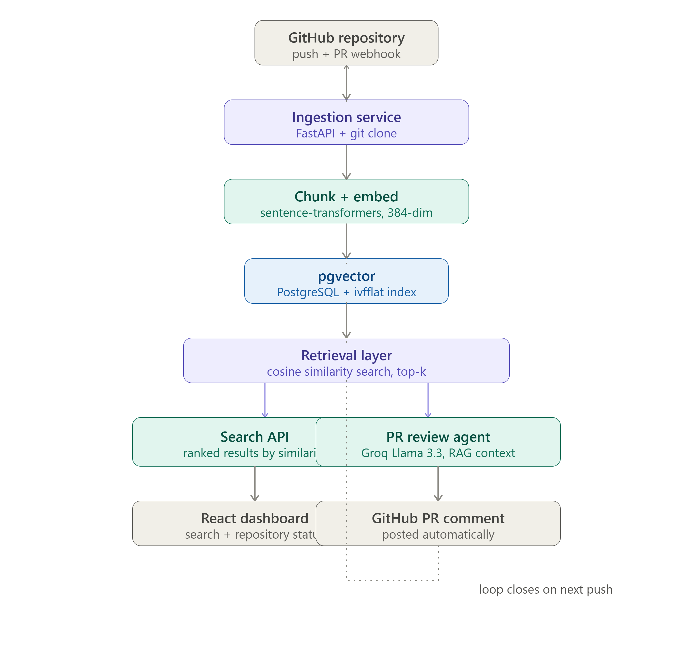

# AI Code Intelligence Platform

**A search engine for your codebase that understands meaning, not just keywords — plus an AI agent that reviews every pull request automatically.**

Ask *"where do we handle retries"* and it finds the right function even if it's named `backoffDelay()` and shares zero words with your query. Open a pull request and an AI agent reads the diff, pulls in similar code from your own repo as context, and posts a real review comment — before a human even looks at it.

🔗 **Live demo:** [add your deployed link here]
📹 **Demo walkthrough:** [add a screen recording link here]

---

## Why this exists

Grep and Ctrl+F only match exact text. If a developer searches *"rate limiting"* but the code is written as `throttleRequests()`, keyword search finds nothing — even though that's exactly the code they wanted. Every large codebase has this problem: knowledge about *where things live* lives only in the heads of the people who wrote it.

This platform solves that by converting every function into a 384-dimension vector using a real deep learning embedding model. Code with similar *meaning* ends up as nearby vectors — regardless of variable names, comments, or phrasing. On top of that, a retrieval-augmented agent uses this same index to review pull requests with actual codebase context, not generic advice.

---

## See it in action

Real output from this exact platform, indexed against a live production repository:

> **Query:** `"how does the retry logic work"`

| Match | File | Function |
|---|---|---|
| 29% | `queue/DLQ.js` | `replay` |
| 28% | `tests/queue.test.js` | — |
| 25% | `utils/backoff.js` | `getBackoffDelay` |
| 24% | `workers/Worker.js` | `Worker` |

None of these function names contain the words *"retry"* or *"logic"* — the model found them by meaning alone.

> **AI PR Review — posted automatically on a real pull request:**
>
> *"The pull request introduces a comment at the end of the file, which does not affect functionality but is inconsistent with the existing codebase pattern of no trailing newline."*
> **[LOW]** `backend/src/utils/backoff.js` — *Suggestion: remove the trailing comment for consistency.*

---
## Architecture

<p align="center">
  
</p>
---
[](https://github.com/Abdulla-1234/AI-Code-Intelligence-Platform/actions/workflows/ci.yml)
[](https://python.org)
[](https://fastapi.tiangolo.com)
[](https://react.dev)
[](https://postgresql.org)
[](https://github.com/pgvector/pgvector)
[](https://groq.com)
[](#run-tests)
[](LICENSE)
---

## Features

- **Semantic code search** — natural-language queries return the right code even with zero keyword overlap, ranked by cosine similarity
- **Function-level chunking** — Python and JS/TS files are split at function/class boundaries, not arbitrary line counts, for higher-quality embeddings
- **Automatic re-indexing** — a GitHub webhook (HMAC-signature verified) triggers re-ingestion on every push, keeping the index continuously in sync
- **RAG-powered PR review** — the review agent retrieves similar existing code before reviewing a diff, so feedback is consistent with the codebase's own patterns, not generic
- **Real GitHub integration** — reviews are posted as actual comments on the pull request via the GitHub API, not just shown in a dashboard
- **Tuned vector index** — `ivfflat` index list count tuned for the dataset size after debugging a real small-scale pgvector retrieval bug
- **Tested** — pytest suite covering chunking, embedding, batch embedding, and full search retrieval against a live PostgreSQL instance
- **CI/CD** — GitHub Actions runs the full suite against a real `pgvector/pgvector` Postgres container on every push

---

## Tech Stack

| Layer | Technology |
|---|---|
| ML / Embeddings | `sentence-transformers` (all-MiniLM-L6-v2, 384-dim) |
| LLM | Groq — Llama 3.3 70B |
| Orchestration | LangChain |
| Backend | Python, FastAPI |
| Vector store | PostgreSQL 15 + `pgvector` extension |
| Frontend | React, TanStack Router, TailwindCSS, shadcn/ui |
| Integration | GitHub REST API, GitHub Webhooks (HMAC verified) |
| Infra | Docker, Docker Compose |
| Testing | pytest |
| CI/CD | GitHub Actions |
| Local webhook testing | ngrok |

---

## Quick Start

```bash
git clone https://github.com/Abdulla-1234/AI-Code-Intelligence-Platform.git
cd AI-Code-Intelligence-Platform

# Start PostgreSQL (with pgvector) + Redis
docker compose up -d

# Backend
cd ml-service
python -m venv venv
venv\Scripts\activate        # Windows
pip install -r requirements.txt
cp .env.example .env          # add your GROQ_API_KEY and GITHUB_TOKEN
uvicorn app.main:app --reload --port 8000

# Frontend (new terminal)
cd ../frontend
npm install
npm run dev
```

Open **http://localhost:8080**.

### Get free API keys

- **Groq:** [console.groq.com](https://console.groq.com) → API Keys → Create Key (no credit card required)
- **GitHub token:** [github.com/settings/tokens](https://github.com/settings/tokens) → Generate new token (classic) → check `repo` scope

---

## API Reference

| Method | Endpoint | Description |
|---|---|---|
| `GET` | `/api/repositories` | List all indexed repositories |
| `POST` | `/api/repositories` | Connect a new GitHub repo, triggers async indexing |
| `POST` | `/api/search` | Semantic search across one or all indexed repos |
| `GET` | `/api/pr-reviews` | List all AI-generated PR reviews |
| `POST` | `/api/webhooks/github` | GitHub webhook receiver (push + pull_request events) |

### Index a repository

```bash
curl -X POST http://localhost:8000/api/repositories \
  -H "Content-Type: application/json" \
  -d '{"url":"https://github.com/owner/repo"}'
```

### Search semantically

```bash
curl -X POST http://localhost:8000/api/search \
  -H "Content-Type: application/json" \
  -d '{"query":"where do we validate JWT tokens"}'
```

---

## Run Tests

```bash
cd ml-service
pytest tests/ -v
```

5 tests covering:
- Function-boundary chunking correctness
- File-extension routing (Python vs JS/TS vs unsupported)
- Embedding dimensionality (384)
- Batch embedding consistency
- Full semantic search retrieval against a live PostgreSQL + pgvector instance

---

## CI/CD Pipeline

Every push to `main` triggers GitHub Actions to:

1. Spin up a real `pgvector/pgvector:pg15` PostgreSQL container
2. Install dependencies from a minimal, hand-audited `requirements.txt`
3. Run the full pytest suite against the live database
4. Report pass/fail via the badge at the top of this README

See [`.github/workflows/ci.yml`](.github/workflows/ci.yml).

---

## Project Structure

```
AI-Code-Intelligence-Platform/
├── ml-service/
│   ├── app/
│   │   ├── services/
│   │   │   ├── chunker.py         function/class-boundary code splitting
│   │   │   ├── embedder.py        sentence-transformer embedding generation
│   │   │   ├── ingest.py          repo walk + chunk + embed + store pipeline
│   │   │   ├── search.py          pgvector cosine similarity search
│   │   │   ├── review_agent.py    RAG-powered PR review via Groq
│   │   │   └── github_client.py   GitHub REST API wrapper
│   │   ├── db.py                  PostgreSQL + pgvector schema
│   │   └── main.py                FastAPI app, routes, webhook handler
│   ├── tests/
│   │   └── test_pipeline.py
│   ├── requirements.txt
│   └── pytest.ini
│
├── frontend/
│   └── src/routes/
│       ├── index.tsx              repositories dashboard
│       ├── search.tsx             semantic search UI
│       ├── pr-reviews.tsx         AI review log
│       └── settings.tsx
│
├── docs/
│   └── architecture.svg
│
├── docker-compose.yml
└── .github/workflows/ci.yml
```

---

## Design Decisions

**Why chunk at function/class boundaries instead of fixed-size windows?**
Embedding models produce better vectors for semantically complete units. A fixed 50-line window might cut a function in half, mixing two unrelated pieces of logic into one embedding and degrading search quality. Function-level chunking falls back to fixed windows only when no functions are detected (e.g. config files).

**Why pgvector instead of a dedicated vector database (Pinecone, Weaviate)?**
The project already needs PostgreSQL for relational data (repositories, PR reviews). Adding one extension avoids running and paying for a second database system, and `ivfflat` indexing is genuinely fast enough at this scale. The tradeoff is documented from a real bug encountered during development: with very few rows, an over-provisioned `lists` parameter on the index caused searches to return zero results — a known pgvector gotcha at small scale, fixed by tuning `lists` to the actual row count.

**Why retrieve similar code before reviewing a PR, instead of just sending the diff to the LLM?**
A raw LLM call reviews code in a vacuum, applying generic best practices that may not match how this specific codebase already does things. Retrieving similar existing functions first gives the model real context — "this is how we already handle errors here" — producing feedback that's actually consistent with the repository, not just generically correct.

**Why Groq instead of OpenAI?**
Groq's LPU inference returns full PR reviews in a few seconds even across multiple files, and its free tier requires no credit card — important for a project other engineers should be able to run and verify themselves.

**Why ngrok for webhook testing?**
GitHub's servers need a real public URL to deliver webhook events; `localhost` isn't reachable from the internet. ngrok tunnels a public HTTPS URL to the local dev server — the same technique used across real engineering teams during local development, before a permanent public deployment exists.

---

## What I'd add for production

- Replace polling-based frontend refresh with WebSocket push (same pattern used in my [Job Queue System](https://github.com/Abdulla-1234/job-queue-system) project)
- Fine-tune the embedding model on code-comment pairs for higher retrieval accuracy
- Add an eval suite (retrieval precision@k, review-quality scoring) to measure changes objectively rather than by inspection
- Support incremental re-indexing (only changed files) instead of full repo re-clone on every push
- Add authentication and per-user repository access control

---

## License

MIT — see [LICENSE](LICENSE)

---

Built by [Doodakula Mohammad Abdulla](https://github.com/Abdulla-1234) — part of a series of systems projects including a [distributed job queue](https://github.com/Abdulla-1234/job-queue-system) and an [AI meeting intelligence platform](https://github.com/Abdulla-1234/AI-Meeting-Intelligence-Platform).